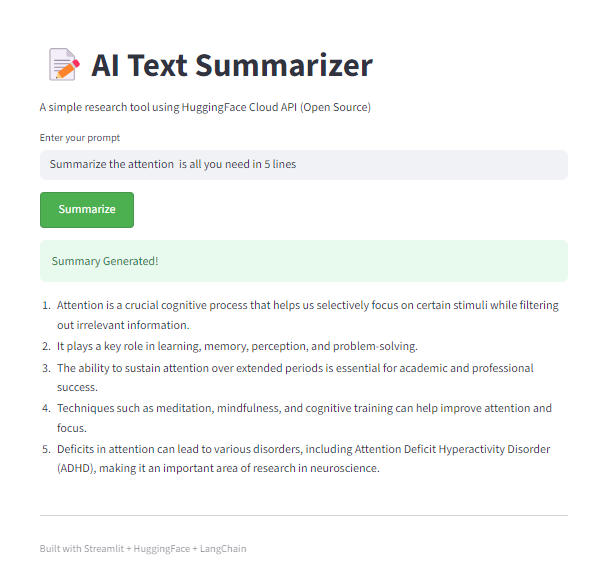

# AI Text Summarizer - Static Prompt Version

A simple learning project to understand **Static Prompts** vs **Dynamic Prompts** in AI applications using HuggingFace Cloud API (Open Source).

## Screenshot



## 🎯 Learning Goal

This project helps me understand the difference between:

### Static Prompt (This Project)
- User types the **exact prompt** they want to send to AI
- No automatic modification or additions
- Example: User types "Summarize this text" → AI receives exactly that
- **Simple and direct** - what you type is what AI gets

### Dynamic Prompt (Next Project)
- App **automatically adds context** or instructions to user input
- Example: User types "Climate change" → App sends "Summarize the following topic in 5 lines: Climate change"
- **More complex** - app modifies the prompt before sending to AI

## What This App Does

Takes user input (text or prompt) and sends it directly to Mistral 7B AI model for summarization - **no prompt engineering or modifications**.

## Tech Stack

- **Streamlit** - Web UI framework
- **HuggingFace Cloud** - AI Model hosting (Mistral 7B - Open Source)
- **LangChain** - AI orchestration framework
- **Python** - Programming language

## Setup

1. Install packages:
```bash
pip install -r requirements.txt
```

2. Create `.env` file and add your HuggingFace token:
```
HF_TOKEN=your_token_here
```
Get free token: https://huggingface.co/settings/tokens

3. Run:
```bash
streamlit run app.py
```

## How It Works

```
User Input → [No Modification] → HuggingFace API → AI Response
```

This is the **static approach** - user has full control over the prompt.

## Key Learning Points

✅ Understanding API connections  
✅ Working with HuggingFace Cloud (open-source models)  
✅ Using LangChain for AI orchestration  
✅ Building UI with Streamlit  
✅ **Static Prompt pattern** - direct user-to-AI communication  

## Next Steps

- Build a **Dynamic Prompt version** that automatically enhances user input
- Compare performance and user experience
- Learn when to use each approach

## License

MIT License - Free to use for learning!
